# Maze game
- author: Richard Plesník
- platform: iOS/iPhone
- developed: 2020
- programming leanguage: Swift

# Project Information

## Description
This is a repository of iOS game, I have been developing mainly during the year 2020. This game was tested on a screen size of iPhone6-8.

Since this is my first experience with mobile application development and with the Swift programming language, there are many things that I would write differently and cleaner nowadays.

This game is still in the design phase, and I practically did not develop it further last and this year. Although I've got other priorities now, I want to come back to this project and finish it when I have more free time. It would need some refactoring and dealing with scaling issues on different display types. When completed, I am also considering publishing it on the AppStore.

## Technical information
The game is developed in the Swift programming language. Game data are stored on a device locally in a json files. Most of the current textures are for development purposes only and will be upgraded later on. 

Game maps are saved in special .save files as 2D arrays of numbers. The maps were generated by a special script I coded in Python as a simple maze (the script is not included in this repository). In the following step, I have manually added special objects such as doors, coins, and teleports to connect nine different map parts.

# Game Information

## Game goal
Each level of a game consists of nine different parts. These parts are ordered as 3x3 squares and connected by doors. In each part of the map, there are 10 hidden coins. The goal of the game is to find all 90 coins to finish the level.

## Special mechanics

### Teleports:
In the center of each map part and nearby each of the doors, there are special teleport tiles. A player can teleport himself between previously discovered and activated teleports.

### Abilities:
Player can also use some special abilities. Each ability has unique function and needs some time to be recharged after it's ussage. Player can use abilities as is coin path advice, teleport or coin magnet. Abilities can be unlocked and upgraded by gained coins in the ability menu.

# Screenshots
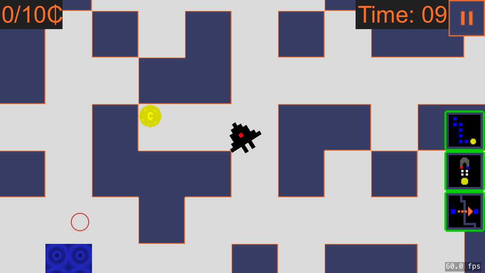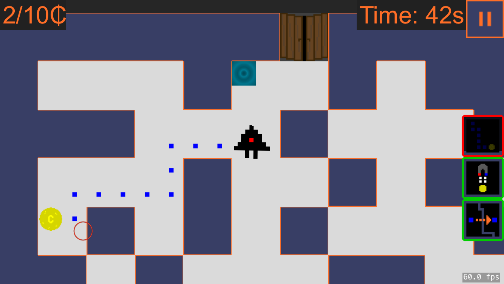
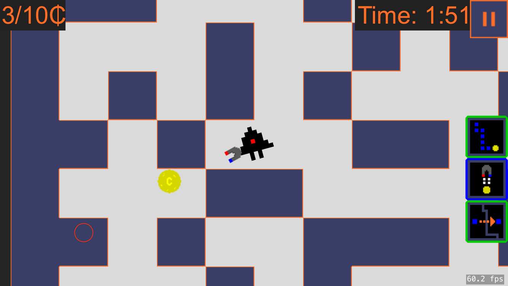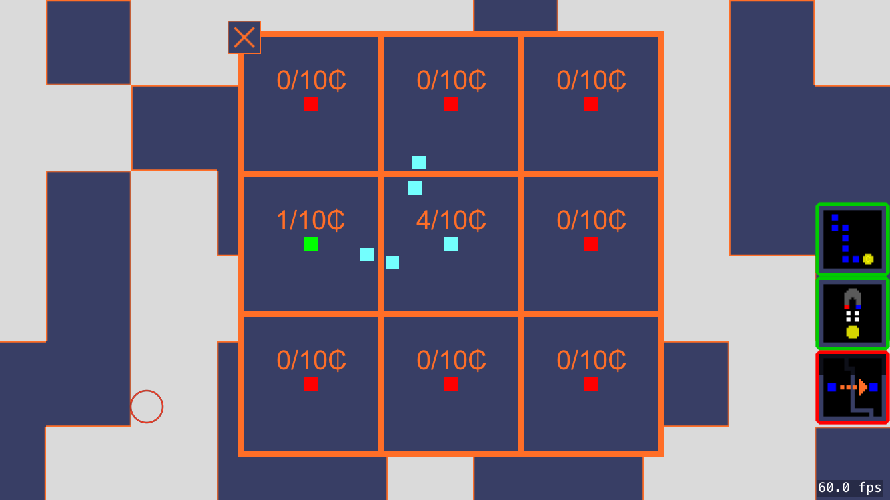
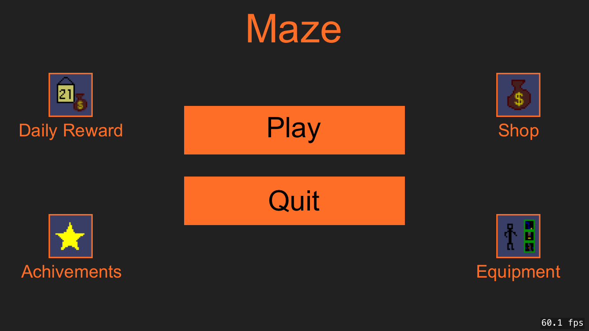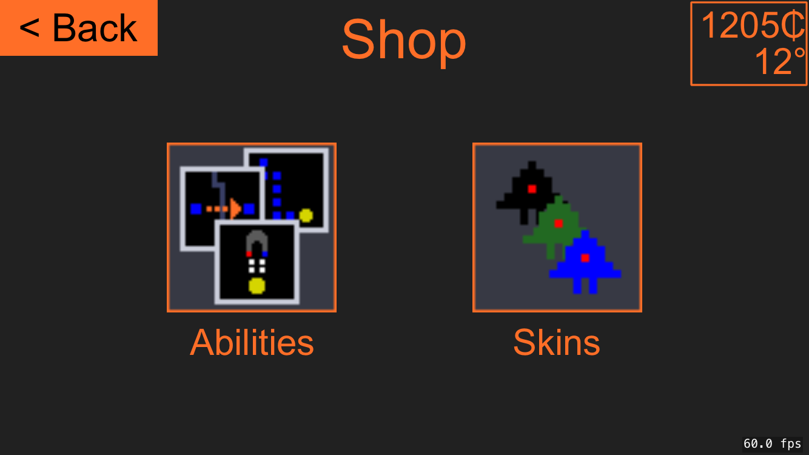
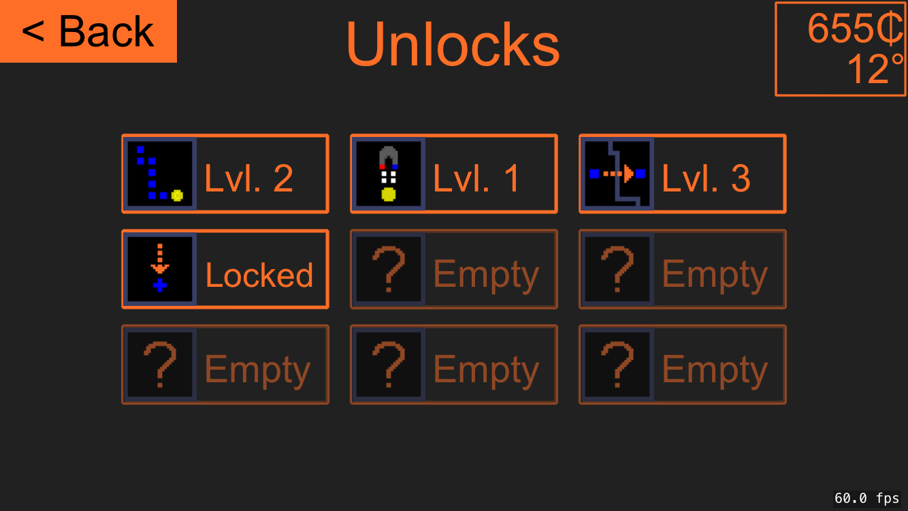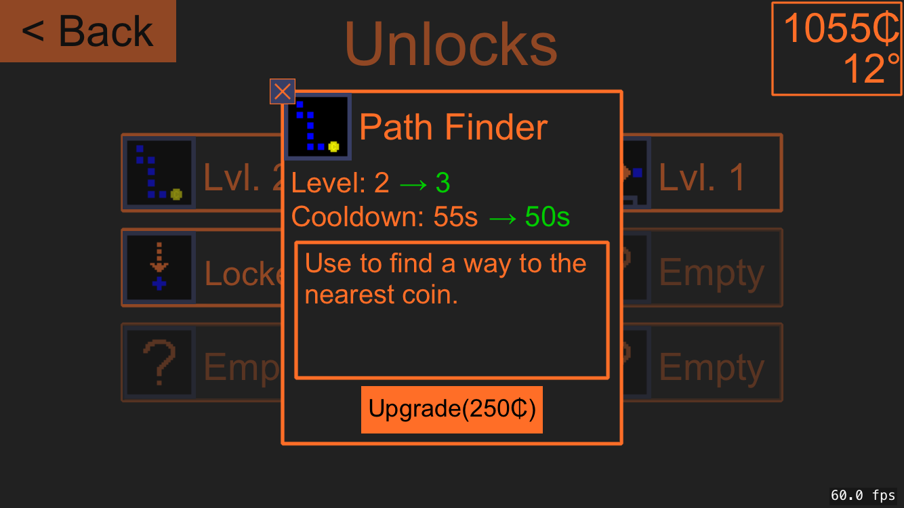
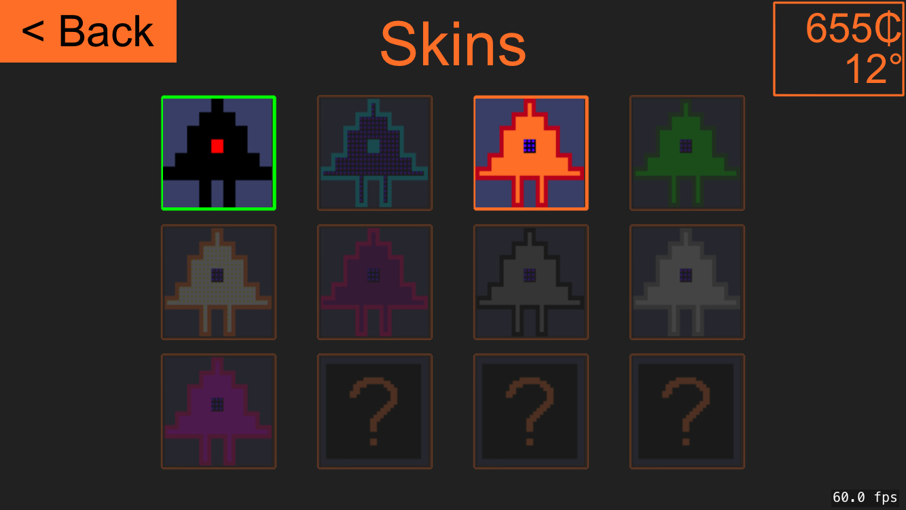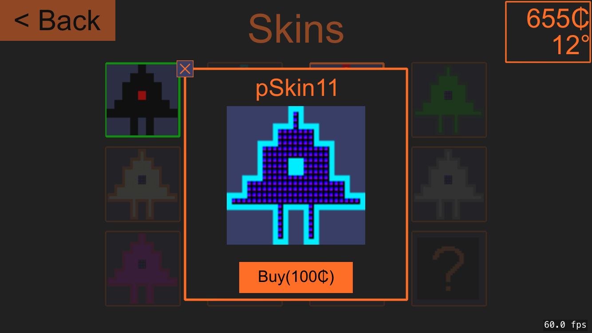
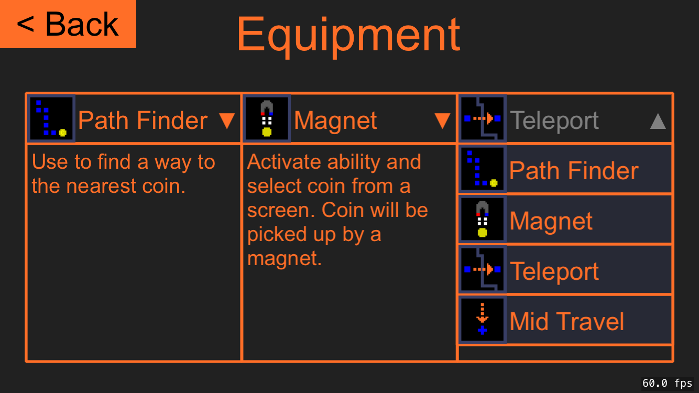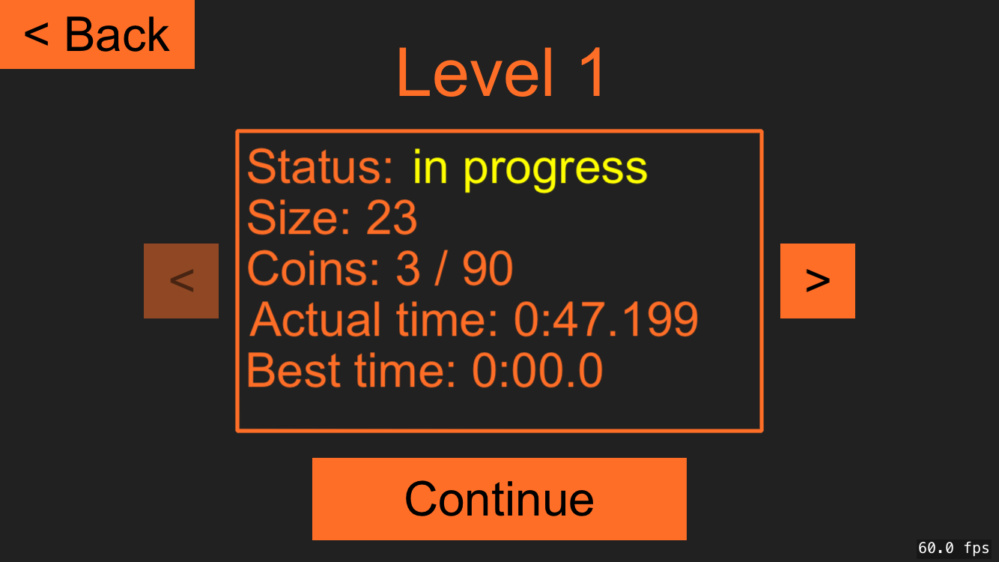
